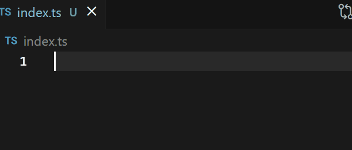

[](https://marketplace.visualstudio.com/items?itemName=RNDev.tickify)
[](https://marketplace.visualstudio.com/items?itemName=RNDev.tickify)
[](https://marketplace.visualstudio.com/items?itemName=RNDev.tickify)
\
A VS Code extension that automatically converts string interpolation to template literals. Never manually convert quotes to backticks again!

## ✨ Features

- **Automatic Conversion**: Instantly converts string interpolation to template literals
- **Smart Detection**: Works with both single and double quotes
- **Zero Configuration**: Works out of the box with no setup required
- **Lightning Fast**: Real-time conversion as you type

### How It Works

When you type `${}` inside single or double quotes in JavaScript/TypeScript files, the extension automatically converts the quotes to backticks, creating a template literal.

**Examples:**

```javascript
"Hello ${name}" => `Hello ${name}`;
"Hello ${name}" => `Hello ${name}`;
```

## 🚀 Installation

1. Open VS Code
2. Press `Ctrl+P` (Windows/Linux) or `Cmd+P` (Mac)
3. Type `ext install RNDev.tickify`
4. Press Enter

## 🎯 Usage

1. Open any JavaScript or TypeScript file
2. Start typing a string with `${}` inside single or double quotes
3. The extension will automatically convert it to a template literal

## 🐛 Known Issues

- May not work correctly with nested template literals
- May not work correctly with escaped quotes

## 🤝 Contributing

Contributions are welcome! Please feel free to submit a Pull Request.

1. Fork the repository
2. Create your feature branch (`git checkout -b feature/amazing-feature`)
3. Commit your changes (`git commit -m 'Add some amazing feature'`)
4. Push to the branch (`git push origin feature/amazing-feature`)
5. Open a Pull Request

## 📜 License

This project is licensed under the MIT License - see the [LICENSE](LICENSE) file for details.

## ☕ Support the Project

If you find this extension helpful and would like to support its development, you can buy me a coffee!

[](https://www.buymeacoffee.com/RNDev)

---

**Enjoy!** If you find this extension helpful, please consider giving it a ⭐️ rating on the [VS Code Marketplace](https://marketplace.visualstudio.com/items?itemName=RNDev.tickify).
